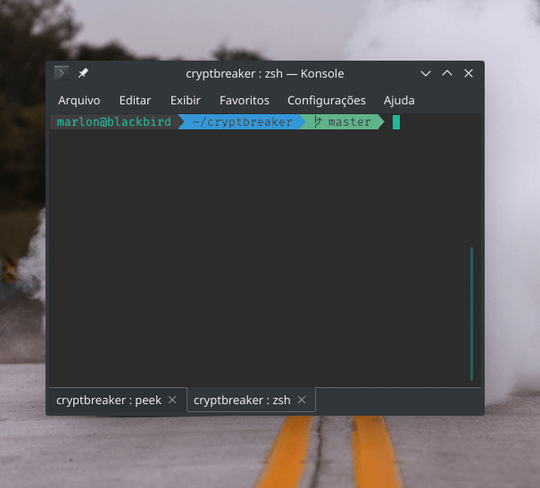

<p align="center">
    
</p>

# cryptbreaker

Quebrando o método `crypt` da biblioteca `crypt.h`, usada para autenticação padrão do kernel GNU Linux/Unix like usando `OpenMP` & `MPI`.

## Build

```sh
    make
```

## Run

- Adicione os hosts da rede OpenMP no arquivo `ip_list`.
- Certifique-se que o seu host possui somente um único processo do `cryptbreaker` executando (`localhost N=1`).
- Certifique-se que você terá acesso a todos os nodos adicionados no ip_list por ssh com certificado. Você deve já ter conectado pelo menos uma única vez para conseguir acesso instantâneo.

- Adicione as hashs ao arquivo `imput`. Ele seguirá o padrão de hash do `crypt`.

<p align="center">
    
</p>

Execute com o comando:

```sh
    make run
```

